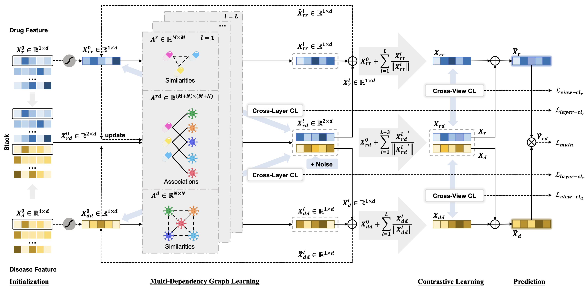

# MDGCN
> Multi-Dependency Graph Convolutional Networks and Contrastive Learning for Drug Repositioning



## Introduction
Drug repositioning aims to discover new therapeutic uses for existing drugs, shortening the drug development process. Recently, several computational drug repositioning methods have been introduced to predict potential drug-disease associations using multi-feature learning. However, existing graph-based approaches primarily focus on modeling drug-disease interaction relationships, often neglecting the semantic influence of node-specific side information on graphs. These methods also suffer from the sparsity and noise inherent in data, leading to unsatisfactory results. To address these limitations, we propose MDGCN, a new drug repositioning method based on multi-dependency graph convolutional networks and contrastive learning. This approach equips graph convolutional networks to propagate side information between diverse graphs in each layer, while contrastive learning provides additional signals for weak supervision. Specifically, we construct multi-dependency graphs using drug and disease similarity matrices along with the drug-disease association matrix. By employing multi-layer graph convolutional networks, we thoroughly mine and update the representation information. Additionally, cross-view contrastive learning assisted by cross-layer contrastive learning aligns node embeddings across multiple views, effectively addressing the weak supervision of drug-disease associations. Extensive experiments demonstrate that MDGCN outperforms other state-of-the-art methods in drug-disease association prediction, providing robust support for exploring new therapeutic indications for drugs of interest.

## Environment
The codes of MDGCN are implemented and tested under the development environment: **Python=3.7.16 | Torch=1.10.0+cu113 | Numpy=1.21.6 | Scipy=1.6.0**, you can see our [requirements.yml](requirements.yml) for details.

## Run
Please clone or download this repository, then run `main.py`
The commands specify the hyperparameter settings that generate the reported results in the paper.

- Fdataset
```
python main.py --dataset Fdataset --epochs 110 --lr 0.05 --layers 8 --rank 4 --topK 3 --ssl_reg_r 0.068 --ssl_reg_d 0.088 --wr1 0.9 --wr2 0.1 --wd1 0.9 --wd2 0.1 --metareg 0.19 --new1 0.9 --eps 0.3
```
- Cdataset
```
python main.py --dataset Cdataset --epochs 70 --lr 0.055 --layers 11 --rank 6 --topK 4 --ssl_reg_r 0.068 --ssl_reg_d 0.085 --wr1 0.7 --wr2 0.3 --wd1 0.7 --wd2 0.3 --metareg 0.15 --new1 0.9 --eps 0.6
```
- LRSSL
```
python main.py --dataset lrssl  --epochs 50 --lr 0.055 --layers 11 --rank 6 --topK 7 --ssl_reg_r 0.08 --ssl_reg_d 0.09 --wr1 0.8 --wr2 0.2 --wd1 0.8 --wd2 0.2 --metareg 0.15 --new1 0.75 --eps 0.2
```

## Datasets

| Dataset           | No. of Drugs | No. of Diseases | No. of Associations | Sparsity |
|-------------------|--------------|-----------------|---------------------|----------|
| Fdataset/Gdataset | 593          | 313             | 1933                | 0.0104   |
| Cdataset          | 663          | 409             | 2532                | 0.0093   |
| LRSSL             | 763          | 681             | 3051                | 0.0059   |

[//]: # (| Ldataset&#40;LAGCN&#41;   | 269          | 598             | 18416               | 0.1145   |)
[//]: # (> Data above from [AdaDR]&#40;https://github.com/xinliangSun/AdaDR/tree/main/AdaDR/raw_data/drug_data&#41;)

### Description

- [Fdataset](https://github.com/BioinformaticsCSU/BNNR)
  - Gottlieb A, Stein GY, Ruppin E, et al. PREDICT: a method for inferring novel drug indications with application to personalized medicine. Mol Syst Biol 2011;7:496.
- [Cdataset](https://github.com/BioinformaticsCSU/BNNR)
  - Luo H, Wang J, Li M, et al. Drug repositioning based on comprehensive similarity measures and bi-random walk algorithm. Bioinformatics 2016;32:2664–71.
- [LRSSL](https://github.com/linwang1982/DRIMC)
  - Liang X, Zhang P, Yan L, et al. LRSSL: predict and interpret drug–disease associations based on data integration using sparse subspace learning. Bioinformatics 2017;33:1187–96.

[//]: # (- [Ldataset]&#40;https://github.com/storyandwine/LAGCN&#41;/LAGCN)
[//]: # (  - Yu Z, Huang F, Zhao X, et al. Predicting drug–disease associations through layer attention graph convolutional network. Brief Bioinform 2020;22:1–11.)

## Result
| Datasets    | MBiRW           | iDrug           | BNNR            | DRWBNCF         | AdaDR           | DRHGCN          | MDGCN           |
|-------------|-----------------|-----------------|-----------------|-----------------|-----------------|-----------------|-----------------|
| AUROC |    |     |      |     |     |     |  |
| **Fdataset** | 0.896±0.014     | 0.905±0.019     | 0.937±0.010     | 0.923±0.013     | 0.952±0.006     | 0.948±0.011     | **0.961±0.010** |
| **Cdataset** | 0.920±0.008     | 0.926±0.010     | 0.952±0.010     | 0.941±0.011     | 0.966±0.006     | 0.964±0.005     | **0.972±0.006** |
| **LRSSL**    | 0.893±0.015     | 0.900±0.008     | 0.922±0.012     | 0.935±0.011     | 0.950±0.010     | 0.961±0.006     | **0.965±0.008** |
| **Average**  | 0.903           | 0.910           | 0.937           | 0.933           | 0.956           | 0.958           | **0.966**       |
| AUPRC |    |     |      |     |     |     |  |
| **Fdataset** | 0.106±0.019     | 0.167±0.027     | 0.328±0.029     | 0.484±0.027     | 0.588±0.041     | 0.490±0.041     | **0.602±0.041** |
| **Cdataset** | 0.161±0.019     | 0.250±0.027     | 0.431±0.020     | 0.559±0.021     | 0.671±0.030     | 0.580±0.035     | **0.694±0.028** |
| **LRSSL**    | 0.030±0.004     | 0.070±0.009     | 0.226±0.021     | 0.349±0.034     | 0.475±0.042     | 0.384±0.022     | **0.501±0.044** |
| **Average**  | 0.099           | 0.162           | 0.328           | 0.464           | 0.578           | 0.485           | **0.598**       |

* The best results are highlighted in **bold**.
